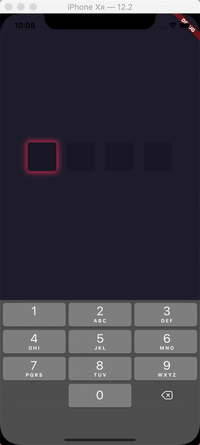

# of_codefield

A highly customized sms-verification-code input widget.



## Getting Started

```yaml
dependencies:
  of_codefield: ^1.0.0
```

```dart
CodeField(
    succeed: (code) {
        print('Input complete! code: $code');
    }
);
```

## More customized

```dart
CodeField({
    this.succeed,           // Completed callback
    this.codeLength = 4,    // Code length, default 4
    this.blockHeight = 60,  // Code block height, default 60
    this.blockWidth = 60,   // Code block width, default 60
    this.blockSpace = 14,   // Space between blocks, default 14
    this.contentBuilder,    // Custom block builder
    this.filledDecoration,  // Block decoration at filled state
    this.focusedDecoration, // Block decoration at focused state
    this.emptyDecoration,   // Block decoration at empty state
    this.keyboardType,      // KeyboardType type, default TextInputType.number
    this.inputFormatters,   // Input Formatters, default [WhitelistingTextInputFormatter.digitsOnly]
});
```